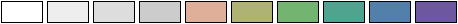

Visualization Helpers
=====================

Suggested Colormaps
-------------------

**Waveguidability proxy** (``‖∇log(PV)‖₂`` with PV in PVU):
The colormap is adapted from a `cubehelix <https://people.phy.cam.ac.uk/dag9/CUBEHELIX/>`_ scheme with ``2.5`` start, ``-2.0`` rotations, ``1.0`` hue and ``1.0`` gamma.
16 levels were extracted, but only the lightest 10 are used.
Colors up to ``1.2e-6`` have been desaturated to highlight the winter-season waveguide detection threshold used by `Polster and Wirth (2023) <https://doi.org/10.22541/essoar.169447416.65437422/v1>`_.

.. code-block:: py

    plt.contourf(
        ...,
        levels=1.0e-6*np.asarray([0.6, 0.8, 1.0, 1.2, 1.4, 1.6, 1.8, 2.0, 3.0]),
        colors=[
            "#FFFFFF", "#EEEEEE", "#DDDDDD", "#CCCCCC", "#DFAF9A",
            "#AEB272", "#74B471", "#4FA48F", "#5280AA", "#6D57A1"
        ],
        extend="both"
    )

**Waveguide occurrence frequency**:
The colormap is adapted from a cubehelix scheme with ``2.0`` start, ``-1.5`` rotations, ``1.4`` hue and ``1.0`` gamma.
13 levels were extracted, but only the lightest 10 are used.

.. code-block:: py

    plt.contourf(
        ...,
        levels=[10, 20, 30, 40, 50, 60, 70, 80, 90],
        colors=[
            "#FFFFFF", "#FFDFE3", "#EED0AA", "#B5D17F", "#70CF83",
            "#48B7AB", "#5288CC", "#7854BD", "#8F307C", "#7B252F"
        ],
        extend="both"
    )

Xarray Interface
----------------

.. automodule:: rwguide.xarray.hovmoeller
    :members:
    :undoc-members:

Numpy Interface
---------------

.. automodule:: rwguide.hovmoeller
    :members:
    :undoc-members:
    :imported-members:

